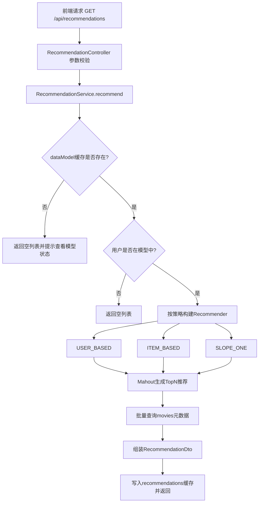
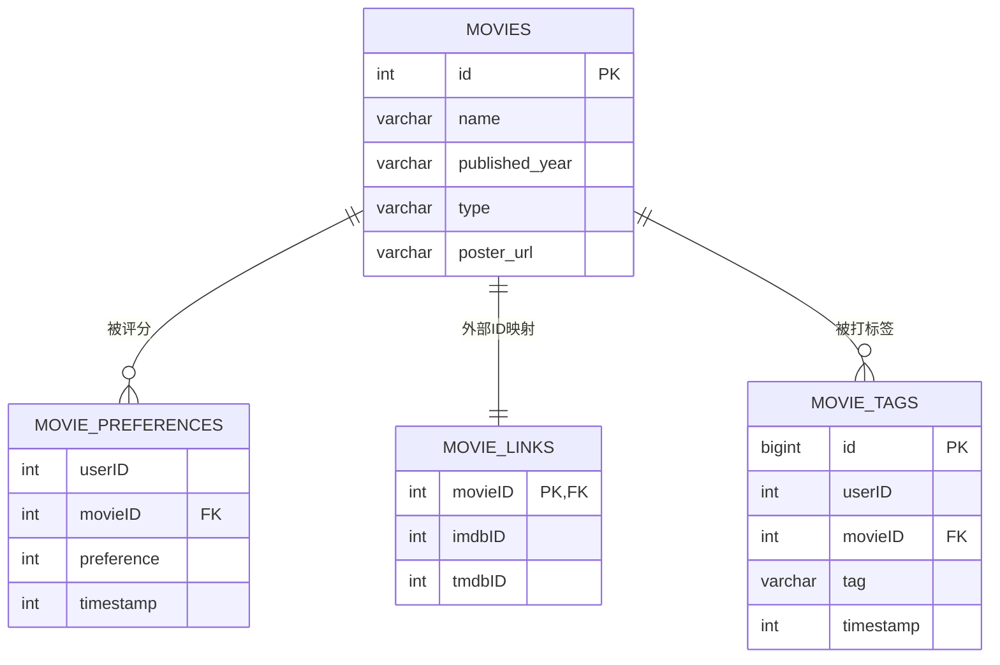

# 第4章 系统总体设计（基于现有后端实现）

> 本章内容基于项目 `backend` 实际代码实现进行反向设计整理，适合作为论文“系统设计”章节初稿。

---

## 4.1 系统总体架构设计（前后端分离、推荐链路）

### 4.1.1 前后端分离架构

本系统采用典型的前后端分离模式：

- **前端层（Vue）**：负责页面展示、交互、路由跳转。
- **后端层（Spring Boot）**：提供 REST API、推荐计算、评分管理、缓存与调度。
- **数据层（MySQL）**：存储电影、评分、标签、外部映射关系等结构化数据。
- **外部服务层（TMDb API）**：用于补充电影海报资源。

从后端实现看，系统采用分层架构：

1. **Controller 层**：暴露 `/api/**` 接口，例如电影检索、推荐、评分、模型管理、健康检查、监控等。
2. **Service 层**：承载业务逻辑，包括推荐算法调度、数据模型预热、评分写入与缓存失效策略。
3. **Mapper 层（MyBatis）**：直接通过注解 SQL 访问 MySQL。
4. **推荐引擎层（Mahout + 自定义 Slope One）**：提供 USER_BASED、ITEM_BASED、SLOPE_ONE 三种推荐策略。

系统通过 CORS 全开放策略允许前端跨域调用后端 API，并通过 OpenAPI 自动生成接口文档，形成“开发—联调—测试”闭环。

### 4.1.2 后端组件关系与职责

#### （1）Web 接入与接口编排

- `MovieController`：电影分页检索、详情。
- `RecommendationController`：按用户与策略返回 TopN 推荐。
- `RatingController`：评分提交、用户评分查询。
- `ModelController`：模型状态、模型重建。
- `PosterController`：海报批量/单个更新。
- `HealthController`：服务状态与评分总量。
- `MetricsController`：缓存命中率、JVM 内存等运行指标。

#### （2）推荐计算核心

`RecommendationService` 是推荐核心服务，职责包括：

- 从缓存获取全局 `DataModel`（键 `global`）；
- 校验用户是否在模型中；
- 按策略构建 Recommender；
- 调用 Mahout 推荐接口生成候选集；
- 批量回填电影元信息（避免 N+1 查询）。

#### （3）模型生命周期管理

`ModelWarmupService` 与 `ModelBuildTask` 共同管理模型：

- 系统启动后延迟异步预热；
- 支持手动重建；
- 支持定时（cron）每小时重建；
- 维护构建状态（未开始/构建中/成功/失败）及耗时统计。

### 4.1.3 推荐链路（核心业务链）

推荐请求链路如下：



该链路的关键优化点：

- **模型与结果双缓存**：降低重复构建与重复计算开销；
- **流式加载评分数据建模**：降低大数据集内存压力；
- **批量电影查询**：避免每条推荐逐条查库导致的 N+1 性能问题。

### 4.1.4 非功能设计要点

- **并发与异步**：通过 `@EnableAsync` + 线程池执行模型预热与海报更新等后台任务。
- **可观测性**：提供缓存统计、内存统计、健康检查与模型状态 API。
- **稳定性**：统一异常处理将校验错误、业务错误、数据库错误转换为标准错误响应。
- **可维护性**：Controller/Service/Mapper 职责边界清晰，便于后续扩展（如新增策略、AB 实验等）。

---

## 4.2 系统功能模块设计

本系统可划分为 7 个功能模块。

### 4.2.1 电影检索模块

**目标**：支持电影列表浏览、关键字检索与详情查看。

**核心功能**：

- 分页查询电影列表；
- 按名称关键字模糊匹配；
- 根据电影 ID 查询详情（含海报 URL）。

**实现要点**：

- Service 层对分页参数进行合法性校验；
- Mapper 层通过 SQL 计算总量 + 分页查询；
- DTO 输出与 Entity 解耦，减少对数据库结构直接暴露。

### 4.2.2 推荐模块

**目标**：为目标用户输出个性化电影推荐。

**策略支持**：

1. USER_BASED（用户协同过滤）
2. ITEM_BASED（物品协同过滤）
3. SLOPE_ONE（差值预测）

**输入参数**：`userId`、`size(1~50)`、`strategy`。

**输出内容**：电影基础信息 + 推荐分数。

**实现要点**：

- 若模型未就绪则返回空列表，避免请求阻塞；
- 用户不存在于模型中时快速失败；
- 推荐结果按（用户+数量+策略）维度缓存，提升高频访问性能。

### 4.2.3 评分管理模块

**目标**：承接用户反馈并驱动推荐实时更新。

**核心功能**：

- 用户提交评分（1~5）；
- 查询用户全部评分历史。

**关键机制**：

- 评分写入采用 upsert（存在则更新，不存在则插入）；
- 写入后清空模型缓存与推荐缓存；
- 异步触发模型重建，缩短“反馈生效延迟”。

### 4.2.4 模型管理模块

**目标**：保障推荐模型可用、可监控、可重建。

**核心功能**：

- 查询模型状态（就绪状态、构建时间、耗时、错误信息）；
- 手动触发重建；
- 启动后自动预热 + 定时重建。

**设计价值**：

- 将“离线建模”从“在线请求”中剥离，提升接口稳定性与响应时间可预测性。

### 4.2.5 海报更新模块

**目标**：补全电影视觉信息，提高前端展示质量。

**核心功能**：

- 批量更新缺失海报；
- 快速更新前 N 部电影海报（演示/验收场景）；
- 单片更新。

**实现要点**：

- 调用 TMDb 搜索接口按电影名（可带年份）检索；
- 写回 `movies.poster_url`；
- 控制请求频率（sleep 250ms）避免外部 API 限流。

### 4.2.6 监控诊断模块

**目标**：提供运维可见性与故障定位入口。

**核心功能**：

- 健康状态检查 `/api/health/status`；
- 评分总量统计 `/api/health/rating-count`；
- 缓存命中率统计 `/api/metrics/cache`；
- JVM 内存统计 `/api/metrics/memory`；
- 缓存清理 `/api/metrics/cache/clear`。

### 4.2.7 异常与接口规范模块

**目标**：统一错误语义、降低前后端联调成本。

**实现方式**：

- 全局异常处理器捕获参数校验错误、业务异常、数据库异常、通用异常；
- 统一返回 `ApiErrorResponse`，包含错误码、消息、路径与细节。

---

## 4.3 数据库总体设计（ER 图、表结构）

### 4.3.1 概念模型与实体关系

系统核心实体为：电影（movies）、用户评分（movie_preferences）、外部映射（movie_links）、标签（movie_tags）。

从业务语义看，**用户—电影**是多对多关系，`movie_preferences` 是关联实体并携带评分值与时间戳。

### 4.3.2 ER 图（文本/论文可直接引用）



> 注：代码中用户信息主要通过 `userID` 维度在评分表中体现，未独立实现 `users` 表。

### 4.3.3 逻辑表结构设计

#### （1）movies（电影主表）

- `id`：主键，自增；
- `name`：电影名；
- `published_year`：年份；
- `type`：类型/流派；
- `poster_url`：海报地址。

**作用**：承载电影基础信息，是推荐结果回填和前端展示的数据源。

#### （2）movie_preferences（评分事实表）

- `userID`：用户标识；
- `movieID`：电影标识（外键关联 movies.id）；
- `preference`：评分值；
- `timestamp`：评分时间。

**作用**：推荐建模的核心输入；支持按用户查评分、按全量流式加载评分。

#### （3）movie_links（外部平台映射表）

- `movieID`（主键 + 外键）；
- `imdbID`；
- `tmdbID`。

**作用**：用于与外部系统（IMDb/TMDb）进行 ID 对齐，支持后续数据扩展。

#### （4）movie_tags（标签表）

- `id` 主键；
- `userID`、`movieID`；
- `tag`；
- `timestamp`。

**作用**：可作为后续混合推荐（协同过滤 + 内容标签）的输入基础。

### 4.3.4 索引与约束设计

- `movie_preferences`：
  - 用户索引、电影索引、用户+电影组合索引；
  - 电影外键约束，确保数据完整性。
- `movie_links`：
  - `imdbID`、`tmdbID` 索引，支持外部映射检索。
- `movie_tags`：
  - 用户、电影、标签文本、用户+电影组合索引，兼顾检索与统计。

### 4.3.5 与推荐链路的映射关系

- 建模阶段：读取 `movie_preferences` 全量评分流。
- 推荐回填：按推荐出的 `movieID` 批量查询 `movies`。
- 展示增强：缺失海报时调用 TMDb 并回写 `movies.poster_url`。

---

## 4.4 接口设计（REST API）

### 4.4.1 设计原则

- 资源导向 URI：`/api/movies`、`/api/ratings`、`/api/recommendations` 等。
- 语义化 HTTP 方法：查询用 `GET`，写入/触发任务用 `POST`。
- 参数校验前置：对 `userId`、`size`、评分区间等进行约束。
- 统一错误响应：由全局异常处理输出标准错误对象。

### 4.4.2 接口清单

#### A. 电影接口

1. `GET /api/movies`
   - **说明**：分页检索电影。
   - **参数**：`query`（可选）、`page`（默认0）、`size`（默认20）。
   - **返回**：`Page<MovieDto>`。

2. `GET /api/movies/{id}`
   - **说明**：查询电影详情。
   - **返回**：存在则 200 + `MovieDto`，不存在返回 404。

#### B. 推荐接口

3. `GET /api/recommendations`
   - **说明**：按策略生成用户推荐列表。
   - **参数**：`userId`（必填）、`strategy`（必填）、`size`（1~50，默认10）。
   - **返回**：`List<RecommendationDto>`。

#### C. 评分接口

4. `POST /api/ratings`
   - **说明**：提交或更新评分。
   - **请求体**：`{ userId, movieId, rating }`，rating 范围 1~5。
   - **返回**：成功消息字符串。

5. `GET /api/ratings/user/{userId}`
   - **说明**：查询指定用户评分历史。
   - **返回**：`List<RatingDto>`。

#### D. 模型管理接口

6. `GET /api/model/status`
   - **说明**：查询模型状态（是否可用、构建时间、耗时等）。

7. `POST /api/model/rebuild`
   - **说明**：手动触发模型异步重建。

#### E. 海报管理接口

8. `POST /api/posters/update-all`
   - **说明**：批量更新所有缺失海报。

9. `POST /api/posters/update-first?count=100`
   - **说明**：快速更新前 N 部电影海报。

10. `POST /api/posters/{movieId}?movieName=...&year=...`
    - **说明**：更新单片海报。

#### F. 健康与监控接口

11. `GET /api/health/status`
12. `GET /api/health/rating-count`
13. `GET /api/metrics/cache`
14. `GET /api/metrics/memory`
15. `GET /api/metrics/cache/clear`

### 4.4.3 关键请求/响应示例

#### 示例1：获取推荐

```http
GET /api/recommendations?userId=1&strategy=ITEM_BASED&size=10
```

响应（示意）：

```json
[
  {
    "movieId": 1196,
    "movieName": "Star Wars: Episode V - The Empire Strikes Back",
    "publishedYear": "1980",
    "genres": "Action|Adventure|Sci-Fi",
    "posterUrl": "https://image.tmdb.org/t/p/w500/xxx.jpg",
    "score": 4.73
  }
]
```

#### 示例2：提交评分

```http
POST /api/ratings
Content-Type: application/json

{
  "userId": 1,
  "movieId": 1196,
  "rating": 5
}
```

响应（示意）：

```text
评分提交成功
```

### 4.4.4 接口安全与一致性说明（论文可扩展）

当前实现更偏教学/实验系统，默认未引入认证鉴权（如 JWT）。若用于生产场景，建议扩展：

- 登录鉴权与权限控制（普通用户/管理员）；
- 限流熔断（特别是海报更新接口）；
- 审计日志（评分变更、模型重建触发记录）；
- 配置敏感信息脱敏（例如 API Key 改为环境变量读取）。

---

## 4.5 本章小结

本章基于现有后端代码完成了系统总体设计说明，核心结论如下：

1. **架构层面**：系统采用前后端分离与后端分层设计，具备较好的模块解耦性与扩展性。
2. **推荐链路层面**：通过“模型预热 + 策略切换 + 缓存 + 批量回填”的链路设计，实现了准确性与性能的平衡。
3. **数据层面**：数据库围绕电影与评分事实构建，关系结构清晰，可支持后续算法迭代。
4. **接口层面**：REST API 覆盖查询、推荐、反馈、运维等完整闭环，并具备基础参数校验与统一异常处理机制。

因此，本系统已经形成“数据采集（评分）—模型构建—在线推荐—反馈回流—模型更新”的闭环流程，为后续章节（详细设计、实现与实验评估）提供了清晰基础。

